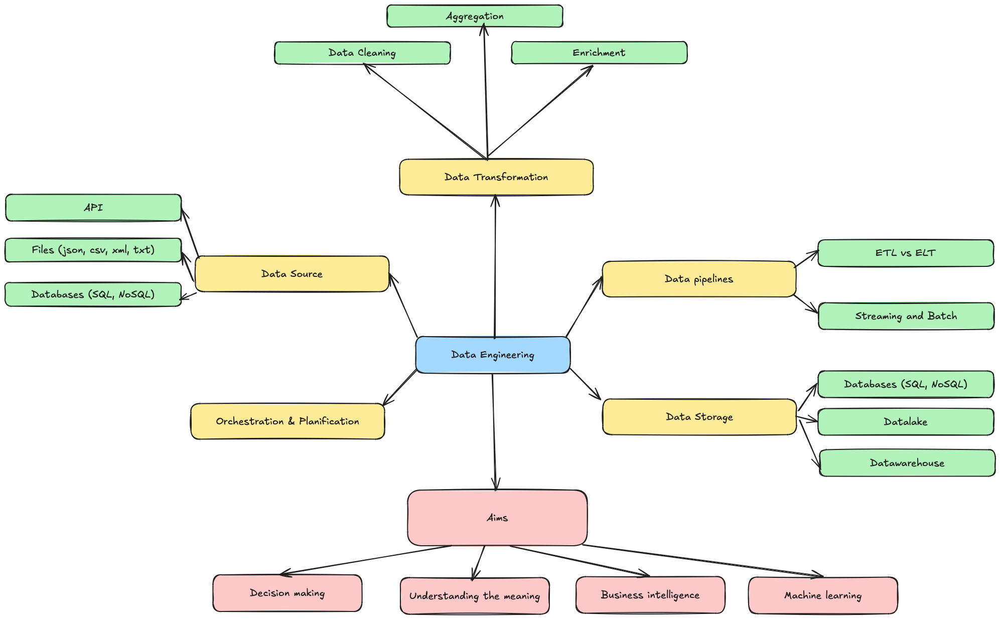
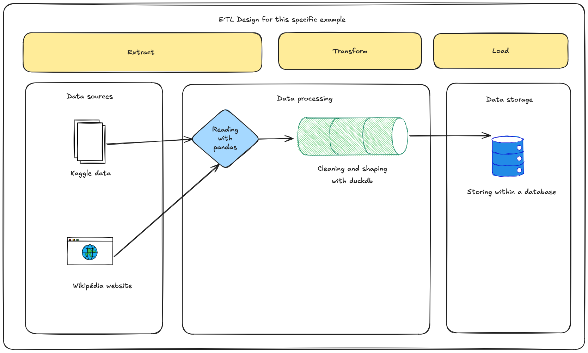

# DataEng-teaching-pipeline

## Introduction

In this project, I will provide necessary information and guidelines for an introduction course to data engineering and data pipeline.
The idea is to answer "Le Wagon" teaching assessment, but for this I need a basis to allow people to follow it.
I also want to keep track about this work and I may, over the time, improve it.
Do not hesitate to fork the project and improce it on your own.

## Requirements

To follow this course, a minimum of technical skills are required.
Understanbding and basic usage of python.

We will use Python3.12.

## Aim

How to build a data pipeline?
What are the main concepts?

## Mindmap

Mindmap of what Data Engineering is.
We will use this to develop our solution.

## ETL and ELT

We will focus on ETL, even if the current mainstream way of doing is ELT (Big query etc.)

### Extract

We will extract data from two different sources in this example:

- The wikipédia website where we will be scraping the data by retrieving the HTML page with the country population.
- The kaggle dataset.
Kaggle is a platform that host data competitions, datasets and forums. It is a useful platform when it comes to learn and practice data skills.
We will use the Python kaggle API to retrieve a specific dataset regarding historical data for country population.

### Transform

In the transform step, we will clean the two DataFrames.
We will also transform the inputs in order to have the same information at the end (for example the same country names).
We will finally merge the two dataset into a single one.

### Load

We will finally export and save our data.
At this stage, we created a datalake (small indeed but still a datalake).

## Example used

We will work on country population example.
We will try to retrive the data through multiple interfaces.

## Tools

I will use a lot excalidraw, that you can access here: https://excalidraw.com
I also like to use Kahoot when it comes to introduce a concept, like for brainstorming we can draw a map of words around a topics: https://kahoot.com/
I will also use Markdown format for some of my schemas.

## Dictionnary

- ELT: Extract, Load, Transform
- ETL: Extract, Transform, Load
- API: Application Programming Interface
- Data scraping: A process of importing data from websites into files or spreadsheets
- SQL: Structured Query Language
- NoSQL: Not only SQL (?)

## Contact

picard.baptiste22@gmail.com
