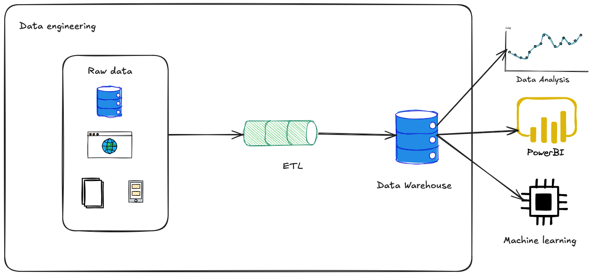

# Introduction to Data Engineering: Building Your First Data Pipeline”

Subject of the lecture: Introduction to data pipelines
Format: Please guide us to understanding through a guided visualization on Excalidraw

## 🪄 Agenda
*aim: The teacher introduces the outline of the lecture*

Today we will go through Data Engineering introduction: "Building your first data pipeline".
For this, we will do a poll where you can write the words that comes to your mind when speaking about data engineering and data pipeline: 

-> usage of kahoot or brain storming

So here is the agenda

1. What is data engineering?
Why is that so important and what value it brings

2. How does it work? How do we build a data pipeline?
   
3. Example live with retrieving country population.

4. Conclusion
   
5. Questions

## Requirements

For this course, you need to have basic knowledge of python and coding.
Python 3.12 should be install.
It is better if you are owning a UNIX / LINUX system as it is more confortable, biut you still can with windows architecture.
However, you may need to make small changes.
You also need to speak english. (I still can do it in french but english is necessary if you want to document yourself online, most of the info is in english).

## 👁️ Demonstrations
*aim: Fosters understanding with concise language, relatable analogies and visual aids ( i.e. sketches, diagrams )*

## Why Data Science Matter - a one minute introduction

Imagine you're Netflix.
You need to know what your users are watching, when, and on which devices.
How do you take data from millions of clicks and turn it into recommendations, billing, and marketing?
That’s where data science comes in.

Data Science is a large topic.
It goes from Data Engineering that we will talk about, Data Analysis that porpuses to understand the data and the meaning, Data Science that purposes to build ML out of it.
But before all of this, you need to retrieve and clean the data.

This is where Data Engineering shows up.
Data engineers retrieves the data, cleans it, shapes it and store it. Often in something called a datalake or a data warehouse.

## What is Data Engineering? - two minutes

Data Engineering is the foundation of modern data systems.
Focuses on designing, building, and maintaining systems for collecting, storing, and analyzing data.
Think of it like plumbing for data—you move it from Point A to B, clean it, and ensure it flows efficiently and safely.

## What is a Data Pipeline? - two minutes

A data pipeline is a series of steps where data goes through different stages.

These steps are usually:

- Extraction – Retrieving data from a source (can be files, databases, APIs, etc)
- Transformation – Cleaning, filtering, and reshaping the data
- Loading – Storing the data in a destination (data warehouse, data lake)

Example:
“It’s like cooking: ingredients (raw data), recipe steps (transformations), final dish (clean, ready-to-use data).”

We usually call it ETL (Extract, Transform, Load):

But we can also

## ❓ Engagement
*aim: Creates a welcoming atmosphere in which asking questions is welcomed and encouraged. Keeps the lecture engaging by relying on appealing methods of explaining technical content ( i.e. live demos, running code )*

## 🗣️ Pace of the presentation
*aim: Keeps the pace of the lecture and focuses on the topic at hand*

## 🏭 Relevance to industry
*aim: Does the teacher present coding practices and concepts **relevant** to industry standards?*

## 💻 Real life cases
*aim: Displays deep expertise by connecting lecture content to real-world use cases and best practices*

## 🧑 🏫 Awareness
*aim: Stays in touch with the classroom, noticing students who did not understand and recaps key learnings and take-aways*

## 👩 💻 Explanations
*aim: Goes from general explanations to tangible, contextualized examples*

## 🧳 Use of resources
*aim: Does the teacher use additional resources, such as slides, diagrams, and videos, to supplement the presentation?*

## 🫡 Voice level
*aim: Volume of the voice is adapted to the room and audience*

## To go further?

Some topics that we did not speak about (too short in 15 minutes).

- Orchestration and usage of git
- Usage of Docker to container the solution
- Storage in a database

## Contact
picard.baptiste22@gmail.com
